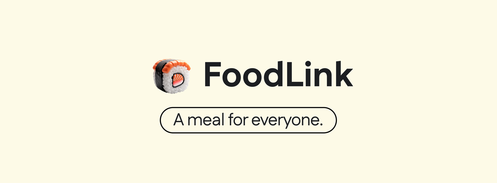

A platform connecting food donors with those in need, reducing food waste, and ensuring everyone has access to nutritious meals.

 

---

## 📖 Table of Contents
- [Overview](#overview)
- [Quick Links](#quick-links)
- [Key Features](#key-features)
- [How We Built It](#how-we-built-it)
- [Challenges We Overcame](#challenges-we-overcame)
- [What’s Next for FoodLink](#whats-next-for-foodlink)
- [Technologies](#technologies)
- [License](#license)

---

## 🥗 Overview
**FoodLink** is designed to connect food donors who have surplus food with individuals and families in need. By creating this link, we not only help reduce food waste but also combat hunger by making sure food is directed to those who need it most.

**Our Mission:**  
To build a supportive community focused on sharing, compassion, and sustainability, ensuring that nutritious food reaches those in need.

---

## 🔗 Quick Links
- [Contributing Guidelines](CONTRIBUTING.md)  
- [Local Setup Instructions](RUN_LOCALLY.md)
- [User Documentation](https://adorable-rook-1b6.notion.site/Foodlink-User-Documentation-11c89fe1340080a8933cf368e6a8bf02)
- [Live Demo](https://food-link-tr86m33it-sushaenis-projects.vercel.app)
- [Devpost project](https://devpost.com/software/foodlink-7p6xym)
- [Figma Prototype](https://www.figma.com/proto/ZQxd67WIsR2CTx7SgZFexv/Foodlink-main?page-id=0%3A1&node-id=0-25&node-type=canvas&viewport=335%2C399%2C0.03&t=wAVQS0nWIcbysccO-1&scaling=scale-down-width&content-scaling=fixed&starting-point-node-id=0%3A25)

---

## 🚀 Key Features
### 🥘 **Food Listings**
Donors can create listings for surplus food items, detailing:
- **Type of food**  
- **Quantity available**  
- **Special notes**, such as allergen information, expiration date, etc.
- **The location** of the listing

### 🤝 **Requests for Food**
Recipients can:
- **Browse** nearby food listings  
- **Make requests** for specific items  
- **Specify** their needs and preferences  
- **Provide additional contact notes** for smooth coordination

### 📚 **Resource Sharing**
Donors can share practical tips and resources with recipients, such as:
- **Food preservation techniques**  
- **Simple, nutritious recipes**  
- **Budgeting tips** for managing limited food supplies

### 🌍 **Map Integration**
Using **Mapbox**, users can:
- **Easily locate** nearby food listings  
- **Select and view** donor locations  
- **Request food** from the closest listings available

---

## 🛠 How We Built It
- **Frontend**: Built with **React** for a responsive and dynamic interface.
- **Backend**: Powered by **Django**, managing user authentication, data storage, and API requests.
- **Database**: Utilised **SQLite** to store user profiles, food listings, and request data.
- **API Integration**: Used **Axios** for smooth communication between the frontend and backend.
- **Prototyping**: Designed and refined the platform using **Figma**, allowing us to visualise and gather feedback early on.
- **Mapping**: Implemented **Mapbox** to allow location-based search for listings and donors.

---

## 🧗‍♂️ Challenges We Overcame
- **API Integration**: Establishing a seamless connection between React and Django while ensuring proper data handling.
- **Mapbox Initialisation**: Addressing issues with the proper display of locations and user interactions on the map.
- **Stylistic Features**: Adding cover images and other design elements to improve the aesthetic appeal and usability of the platform.

---

## 🌟 What’s Next for FoodLink
- **User Reviews & Ratings**: Implementing reviews and ratings for donors to build trust and accountability within the community.
- **Food Request Tracking**: Allowing recipients to track their requests and for donors to manage the delivery process efficiently.
- **Scaling the Platform**: Partnering with organisations and expanding to more communities to maximise our impact.

---

## 💻 Technologies

  &nbsp;
  &nbsp;
  &nbsp;
  &nbsp;
  &nbsp;
  &nbsp;
  &nbsp;
  &nbsp;
  &nbsp;
  &nbsp;

---

## 📝 License
This project is licensed under the [MIT License](LICENSE).

---
